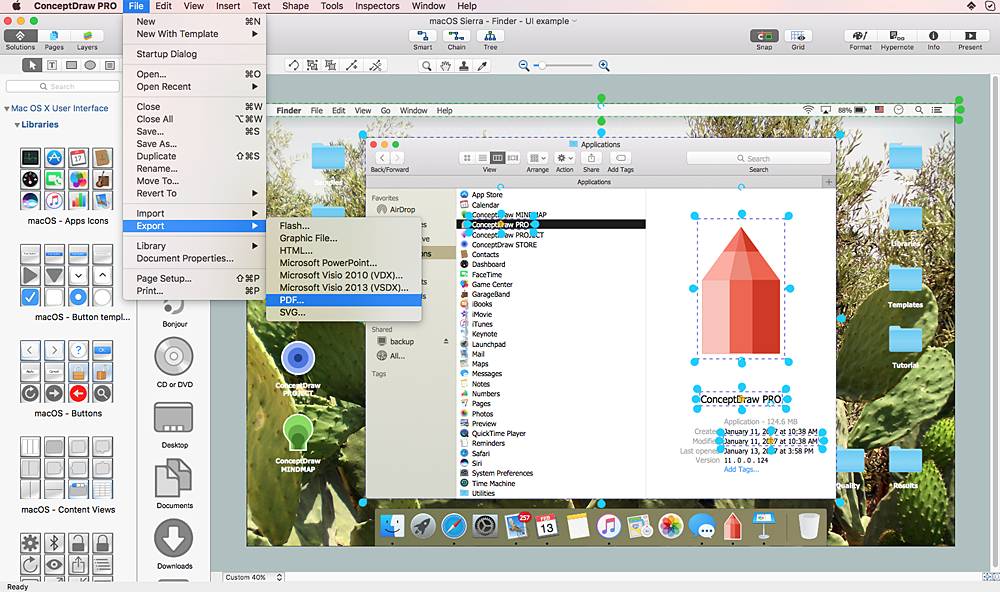

# GUI と CLI

「GUI」と「CLI」とは，ユーザがコンピュータを操作するときの方式である．

## GUI とは

Graphical User Interface の略．

情報の提示に画像や図形を多用し，基礎的な操作の大半をマウスやタッチスクリーンなどによる画面上の位置の指示により行うことができるもの．

「いつも使用している画面上の操作」という認識で問題ない．



## CLI とは

Command Line Interface の略．

コンピュータを操作するすべてのやり取りを文字によって行う方式．予め定められた「コマンド」を入力して操作を行うことが多い．

GUI では，ユーザがマウスやタッチ操作を行うのに対し，CUI で使用するのはキーボードのみ．


## 結局 CLI が必要

もともと PC は CLI しかなかった．

現代の PC は GUI（の表示されたディスプレイ）を見ながら操作する．

一方で，サーバなどを操作する場合には CUI（ターミナルなど）を使用する．自分の PC 内でも，操作によっては CLI が必須な場合がある．

例えば，以下の写真では自分の PC のターミナルからサーバマシンにアクセスしてコマンド操作している．


このように，Web の開発では CLI を使用するタイミングが必ず出てくる．基本的な操作を行って慣れておくことが大切．

## CLI の操作

以下のアプリケーションを立ち上げよう！

これらのアプリケーションからコマンドを実行することができます！

| OS      | コマンドを実行するアプリケーション |
| ------- | ---------------------------------- |
| Mac     | ターミナル（最初から入っている）   |
| Windows | Git Bash（事前準備でインストール） |

※以降，どちらも呼び方はターミナルで統一します！

## 作業フォルダという概念

ターミナルでコマンドを実行するときは必ず現在地（フォルダ）があります！

起動した直後の現在地を「ホームディレクトリ」と呼びます．

コマンドを実行するときは，適切なフォルダに移動する必要がある．

例：あるテキストファイルを編集するコマンドを実行したい場合，テキストファイルが入っているフォルダに移動しなければならない．

【重要】下記のコマンドで現在の作業フォルダを確認できる．

```bash
$ pwd
```

## 代表的な操作

`$`マーク（`%`マークの場合もある）が出ているときはコマンド待機中（入力できる状態）

| コマンド | 実行例         | 意味                                                                                                                                         |
| -------- | -------------- | -------------------------------------------------------------------------------------------------------------------------------------------- |
| `cd`     | `$ cd Desktop` | 最重要．<br>作業ディレクトリを変更する．`cd ..`で 1 階層上に移動．<br>`cd `まで入力して，フォルダのドラッグ&ドロップでも移動先を指定できる． |
| `ls`     | `$ ls -a`      | 現在のディレクトリにあるファイルとフォルダを表示する．<br>` -a`をつけることで隠しファイルやフォルダを表示する．                              |

## ファイルとフォルダの作成

| コマンド | 実行例             | 意味                       |
| -------- | ------------------ | -------------------------- |
| `touch`  | `$ touch memo.txt` | 新しいファイルを作成する． |
| `mkdir`  | `$ mkdir test`     | 新しいフォルダを作成する． |
| `cat`    | `$ cat memo.txt`   | ファイルの内容を表示する． |

## ファイルを編集する

### CLI 上で使えるエディタ

CLI で使用できる`vi`というエディタが存在する．今後多用するため，操作を押さえておこう．

- CLI 上では`vi`と呼ばれるエディタを使用できる（他にもある）．
- `vi`コマンドでエディタを起動する．

```bash
$ vi 編集したいファイルの名前
```

### 使い方の流れ

エディタには「コマンドモード」と「インサートモード」がある．

それぞれのモードでできることは以下のとおり．起動すると最初は必ずコマンドモードになる．

| モード           | できること                   | 切り替え                                    |
| ---------------- | ---------------------------- | ------------------------------------------- |
| コマンドモード   | ファイルの保存，閉じる，など | `i`を入力するとインサートモードへ切り替わる |
| インサートモード | ファイルに対する追記や編集   | `Esc`キーでコマンドモードに切り替わる       |

使い方は主に下記の流れとなる．

- vi を起動する．
- `i` を入力してインサートモードに変化する．`-INSERT-` などが表示される．
- インサートモードで，ファイルに対して文字列の入力や編集が行う．
- `Esc` キーでコマンドモードに戻る．
- コマンドモードで「ファイルを保存」「閉じる」などの操作を行う．

### コマンドモードで使用する代表的なコマンド

| コマンド | 意味                                                     |
| -------- | -------------------------------------------------------- |
| `:w`     | 現在開いているファイルを保存．                           |
| `:q`     | 現在開いているファイルを閉じる．                         |
| `:wq`    | 上記 2 つの組み合わせ．保存して閉じるの意味．            |
| `:q!`    | 保存せずに閉じる．書いていて訳がわからなくなったらこれ． |

## 練習

以下の処理をやってみよう！

CLI 操作に慣れるのが目的！

- ターミナルでデスクトップに移動する．
- `test` フォルダを作成する．
- `test` フォルダに移動する．
- `test` フォルダ内に `sample.txt` ファイルを作成する．
- vi で `sample.txt` を開き，`Hello CLI!` と記述して保存して閉じる．
- ターミナルで `sample.txt` の内容を表示する．（Hello CLI! が表示されれば OK）
- GUI で上記ファイルが作成されていることを確認．

## 【危険】滅びの呪文

PC の全てが死ぬ．絶対に実行してはならない．

（実行すると講義の受講に著しく支障をきたします）

[参考：https://news.mynavi.jp/article/dont_run_on_linux-11/](https://news.mynavi.jp/article/dont_run_on_linux-11/)
