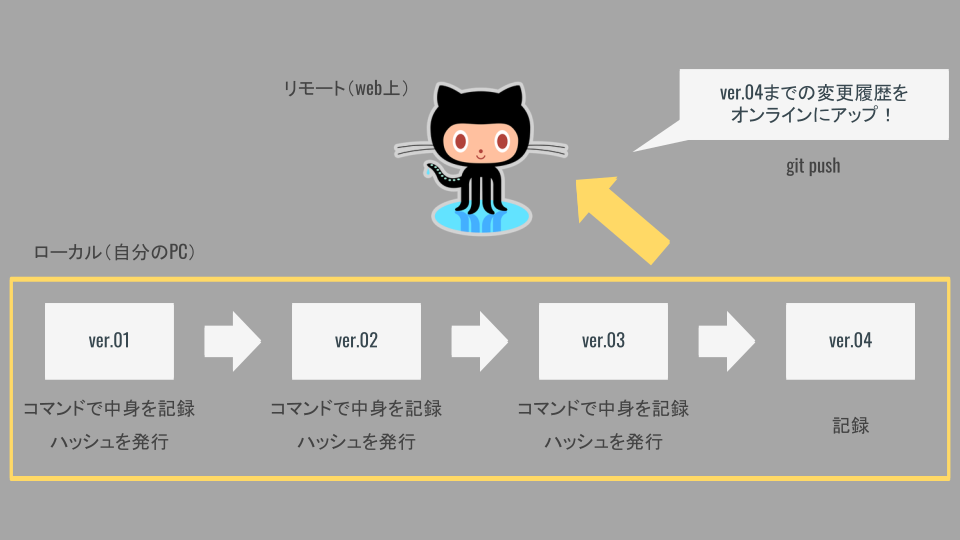
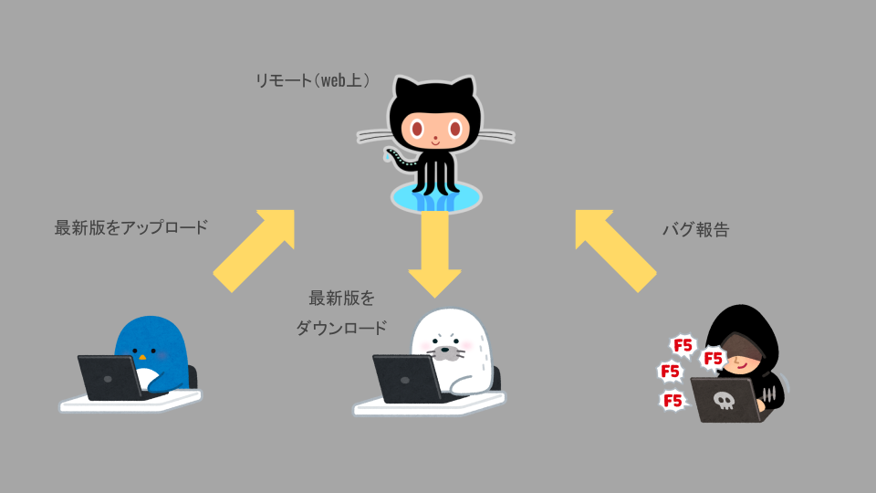

# GitHub概要


## 「Git」と「GitHub」は異なる！

「Gitのバージョン管理」をオンラインで共有できるのがGitHub




## 複数人でのバージョン管理がより簡単に！

オンライン上でソースコードを共有できるため，複数人で協力して開発を進めることが容易になる．




## Githubはエンジニア同士のSNS

GitHubは単にソースコードをオンラインで管理するだけが役割ではない．

その他にも，下記のようなことが実現できる「エンジニアのSNS」であるッ！

- 開発者同士でのソースコード共有．
- 複数人のチームでのプロダクト開発．
- 有志による機能開発とプロダクトへの反映（pull request）
- バグ報告などコードを使ったコミュニケーション（issue）


## 【重要】readmeファイル

ソースコードをGitHubにpushするときは，コードの案内（どんなプロダクトなのか，など）が必要となる．

そのために「`readme`」ファイルというものが存在する．下記の手順で作成してみよう．

1. エディタでプロダクトのフォルダを開き，`readme.md`を新規作成．
2. 新規作成したreadmeファイルに次の内容を記述しよう！
    - `readme`ファイルは「マークダウン形式」で記述する．

```md
# プロダクトのタイトル

## プロダクトの紹介
- 箇条書きにすると
- 読みやすい

## 工夫した点，こだわった点
- 特に見てほしい点，
- うまくできたと感じている点など．

## 苦戦した点，共有したいハマりポイントなど
- ハマった経験は資産．
- あとで自分で見返しても有用．
```

`readme`ファイルはプロダクトのフォルダ内に保存しておき，他のソースコードと一緒にGitHubにpushするとリポジトリの画面に表示される．


## 【重要】ディレクトリ間違えた場合

コマンド`git init`を実行すると隠しフォルダ`.git`が作成される．

このフォルダの中に，バージョンの履歴などが保存されている．

誤ったフォルダで`git init`した場合は，`.git`フォルダを削除するとなかったことにできる．

→再度目的のディレクトリに移動して`git init`しよう！
