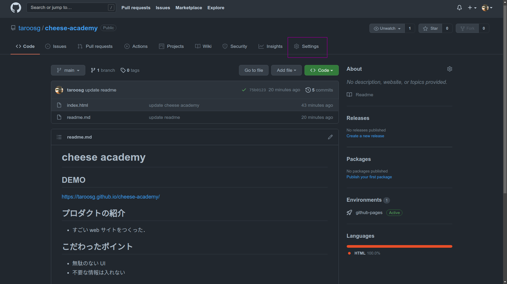
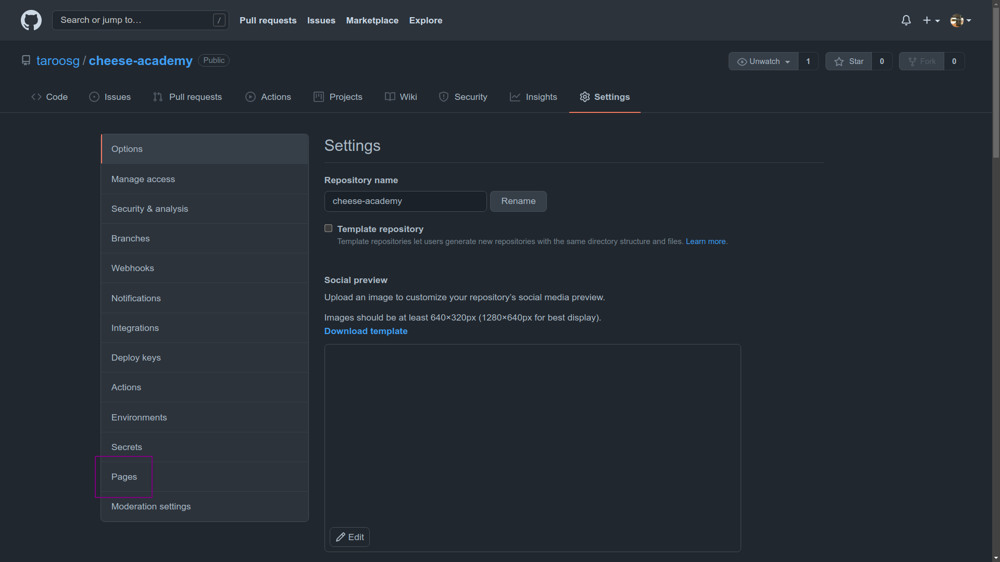
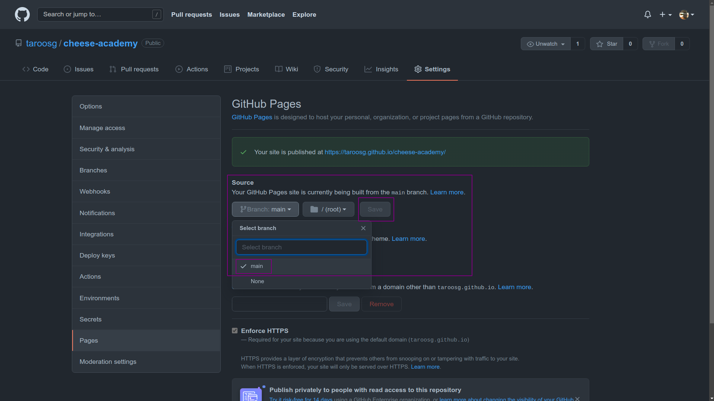

# GitHub Pages を用いたデプロイ

「GitHub Pages」の機能を用いると，任意のブランチのコードをデプロイすることができる．

## 注意点

- GitHub Pages のサーバにはプログラムを動かす機能がないので，デプロイできるのはフロントのコード（HTML，CSS，JS）のみ．
- ソースコードを push した状態でないとうまく設定できない．
- 最初に動かしたいファイル名を `index.html` にしておかないとちょっと面倒（動作はする）．

## 手順

### ブラウザでリポジトリの URL を開き，「settings」をクリックして設定画面を開く．

### 左側の設定項目の「pages」をクリックする．

### 表示された画面中央部の「Source」部分で「main」を選択して「Save」ボタンをクリックする．

### デプロイ先の URL が表示されるのでアクセスして動作を確認する．

- 発行された URL を readme ファイルに書いておくとすぐに試せて良き．
- しばらくしないと反映されない場合があるのでしばらく待機する．
- 新バージョンを push しないと反映されない場合があるので，適当な内容で再度 push して様子を見る．
