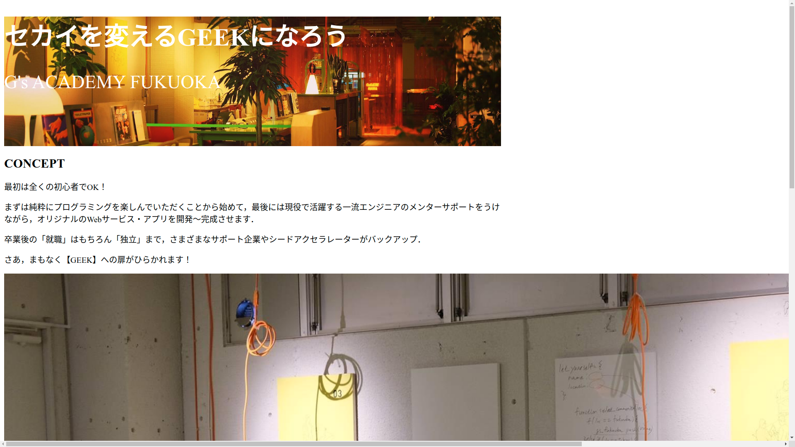

# CSS / ページ設定，背景，文字の大きさ，色

## CSS の基本的な記述方法

CSS は「css ファイル」に記述する．

CSS の命令の適用箇所は HTML 要素（タグやクラス名）を指定する．HTML 要素にクラス名をつけることで，細かく適用箇所を制御することができる．

```css
body {
  /* タグに対して指定 */
  /* ここに文字の色やサイズなどを指定する命令を書く */
}

.hoge {
  /* `.` でクラス名で指定 */
}

.hoge,
.fuga {
  /* 複数のクラスに適用 */
}

.hoge .fuga {
  /* hoge クラス要素の下にある fuga クラスに適用 */
}
```

↓ HTML 要素にクラス名をつける例

```html
<div class="hoge">
  <h1 class="title">セカイを変えるGEEKになろう</h1>
  <p class="fuga">G's ACADEMY FUKUOKA</p>
</div>
```

## ページのサイズ指定

サイズは幅と高さを指定する．

```css
/* 幅を指定 */
.box {
  width: 480px;
}

/* 幅と高さを指定 */
.box {
  width: 480px;
  height: 360px;
}
```

今回は`<body>`タグに対して指定し，ページ全体の幅を 960px に設定する．

```css
body {
  /* body の幅を 960 px に設定する */
  width: 960px;
}
```

## 背景の色，写真の設定

色や画像を設定する．

```css
/* 背景を赤くする場合（#rrggbbの形式でも可） */
.box {
  background: red;
}

/* 背景に画像を設定する場合（画像ファイルの場所を指定する） */
.box {
  background: url(../img/main_bg.jpg);
}
```

画像の場合は大きさや位置を設定するとかっこいい感じになる．

```css
/* 背景画像の大きさ */
.box {
  background-size: cover;
}

/* 背景画像の位置 */
.box {
  background-position: center;
}
```

## 文字の色，大きさの設定

```css
/* 文字の大きさ */
.title {
  font-size: 36px;
}

/* 文字の色（#rrggbbの形式でも可） */
.title {
  color: white;
}
```

## 練習

練習用 Web サイトの以下の部分を実装しよう！

- ページのサイズ設定（全体の幅を 960px に）
- タイトルの背景部分に写真（`main_bg.jpg`）を設定
- タイトル文字の大きさと色を変更（見やすい感じになれば OK！）

↓ ここまでのイメージ


