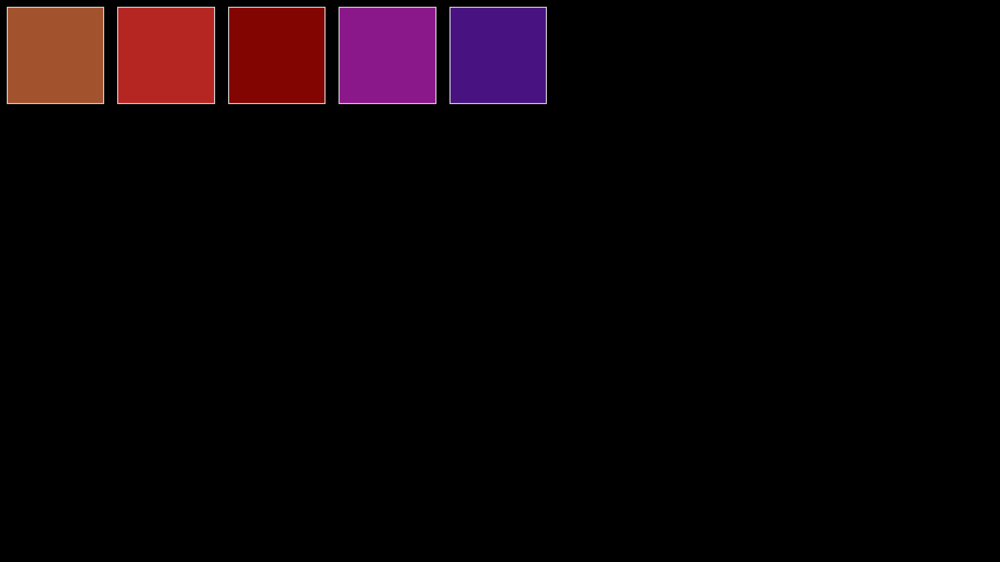
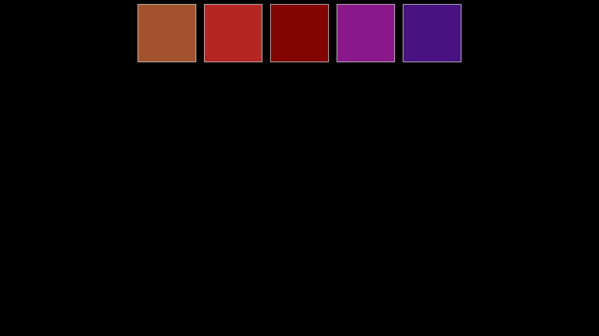
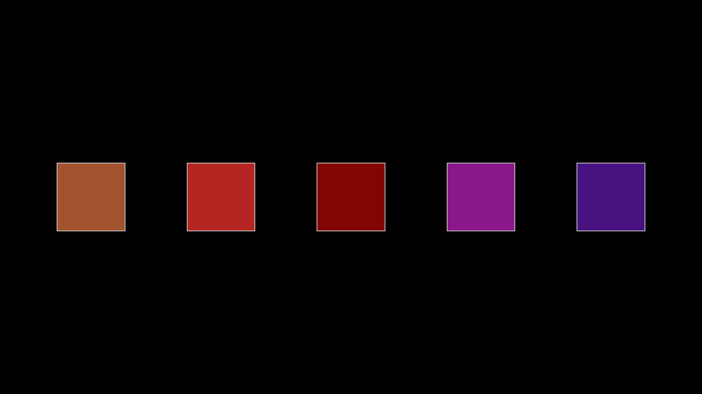

# CSS / レイアウト

## よくあるレイアウト

|          |                             |
| -------- | --------------------------- |
| 横並び   | HTML は縦並びがデフォルト． |
| 左右中央 | HTML は左揃えがデフォルト． |
| 上下中央 | HTML は上揃えがデフォルト． |

## float．．？

float を使うと要素を横並びにできる．．．が．．．


[参考：https://gray-code.com/html_css/release-float-by-clearfix/](https://gray-code.com/html_css/release-float-by-clearfix/)

**ものッ！すごくッ！！めんどくさいィィッッッ！！！！**

## FlexBox が全てを解決するッ！！

- 横並び
- 左右中央揃え
- 上下中央揃え

### HTML のイメージ

下記のような要素を想定する（主な部分のみ記述）．

```html
<div class="l_box">
  <div class="s_box sienna"></div>
  <div class="s_box firebrick"></div>
  <div class="s_box maroon"></div>
  <div class="s_box darkmagenta"></div>
  <div class="s_box indigo"></div>
</div>
```

↓ 画面上はこんな感じ


### 横並び

`display: flex;` を記述！

- HTML は縦並びがデフォルト．
- `display: flex;` を使用すると横並びにできる！

> **💡 Point**
>
> `display: flex;` に関連する CSS は「レイアウトを制御したい要素の外側の要素」に記述する！

```css
.l_box {
  display: flex;
}
```



### 左右中央揃え

`justify-content: center;` を記述！

- HTML は左揃えがデフォルト．
- `justify-content: center;` を使用すると左右中央揃えにできる！

> **💡 Point**
>
> `display: flex;` は常に記述する必要あり！

```css
.l_box {
  display: flex;
  justify-content: center;
}
```



### 上下左右中央揃え

`align-items: center;` を記述！

- HTML は上揃えがデフォルト．
- `align-items: center;` を使用すると上下中央揃えにできる！

```css
.l_box {
  display: flex;
  justify-content: center;
  align-items: center;
}
```


### 縦並びが良い場合

`flex-direction: column;` を記述！

- flex は横並びがデフォルト．
- `flex-direction: column;` を使用すると縦横の並び方を制御できる！

```css
.l_box {
  display: flex;
  justify-content: center;
  align-items: center;
  flex-direction: column;
}
```


### 【参考】いい感じに並べたいとき

均等な感じにしたい場合にも設定できる．

↓ 端に寄せつつ均等に並べる `space-between`

```css
.l_box {
  display: flex;
  justify-content: space-between;
  align-items: center;
}
```


↓ 均等に余白をつくって並べる `space-evenly`

```css
.l_box {
  display: flex;
  justify-content: space-evenly;
  align-items: center;
}
```



## 練習

**FlexBox を駆使して横並び部分を実装しよう！**

ヒント！！

横並びの幅を均等にしたい！

- 横に並んでいる div の width を「50%」にしよう！

画像がはみ出す！

- 画像の width を「100%」に設定すると箱の幅に合わせてくれる！
- 高さが足りないときは height も「100%」！
- 画像の比率がおかしいときは「object-fit」でググれ！


