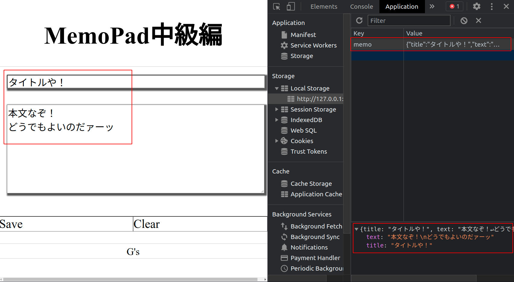

# JSON データ（メモ帳中級）

## メモ帳初級の問題点

データが 1 件しか保存できない．複数のメモを個別に残しておきたいときに困る．

## 複数件のデータを管理する

配列かオブジェクトを使えば複数件のデータをまとめることができる．これを用いればメモ欄が複数になっても管理できそうである．

## だめです

配列やオブジェクトは言語毎に形式が異なるため互換性がない（JavaScript の配列は JavaScript でしか扱えない）．

つまり，LocalStorage も配列やオブジェクトを保存することはできない．


## 互換性のあるデータである JSON 形式

Web アプリケーションは複数の言語で構成されていることが多い．このような場合にお互いのデータをやり取りするため，互換性のある「JSON 形式」が準備されている．

各言語では「自前の配列やオブジェクト」と「JSON 形式のデータ」を相互に変換する処理が準備されている．


## メモ帳中級編のイメージ

タイトルと本文をまとめて保存できるようにする！



## JSON の扱い方

JavaScript には（他の言語でも）「配列やオブジェクトを JSON に変換する処理」と「JSON を配列やオブジェクトに戻す処理」が用意されている．

### 配列やオブジェクトを JSON に変換する処理

`JSON.stringify()`で JSON 形式に変換できる．

```js
const data = {
  title: "波紋の使い方",
  text: "メメタァ",
};

const jsonData = JSON.stringify(data);
localStorage.setItem("memo", jsonData);
```

### JSON を配列やオブジェクトに戻す処理

`JSON.parse()`で JSON 形式から戻すことができる．

```js
const jsonData = localStorage.getItem("memo");
const data = JSON.parse(jsonData);
console.log(data);
```

## 練習

タイトルと本文の両方を保存できるメモ帳を実装しよう．

- 動き方はメモ帳初級編と同様
- save ボタンクリック時に
  - タイトルと本文の値を取得してまとめる．
  - まとめたデータを JSON 形式に変換する．
  - JSON 形式のデータを LocalStorage に保存．
- clear ボタンクリック時にデータを消去
- 読み込み時に
  - LocalStorage から JSON 形式のデータを取得する．
  - JSON 形式のデータをオブジェクトに戻す．
  - オブジェクトからデータを取り出して画面に表示する．
