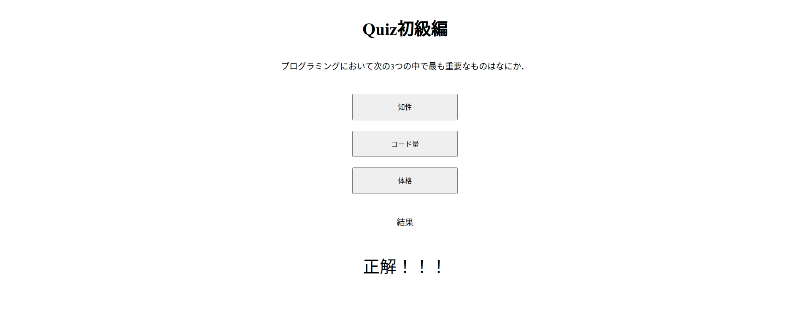

# クイズアプリ初級

## Quiz アプリ初級編の仕様

- ブラウザ上に問題と選択肢を表示．HTML には直接記述しない．
- 選択肢をクリックしたら正解かどうかを判定．
- `alert()`で正解不正解を表示．ブラウザ上にも正解不正解を表示．

↓ 画面を開くと問題が表示される．


↓ 適当なボタンをクリックすると正解不正解が表示される．



## 必要な処理

### 読み込み時の処理

- 指定した場所に問題文を表示する．
- 各ボタンに選択肢を表示する．
- 各ボタンの`value`に選択肢の値を設定する．

### 選択肢クリック時の処理

- button タグの`value`の値を受け取る．
- 正解の値と等しいかどうか判定する．
- 正解不正解を表示する．

## 読み込み時の処理

### HTML 要素

画面の HTML 要素は以下のようになっている．

```html
<h1>Quiz初級編</h1>

<p id="question"></p>

<ul>
  <li><button id="answer00">0</button></li>
  <li><button id="answer01">1</button></li>
  <li><button id="answer02">2</button></li>
</ul>

<p>結果</p>
<p id="result"></p>
```

### JavaScript の処理 1（読み込み時）

1. 指定した場所に問題文を表示する．
   - 問題文と選択肢と正解がオブジェクトにまとまっているので，必要なものを取り出して表示する．
2. 各ボタンに選択肢を表示する．
   - 選択肢は配列に入っているので，個別に取り出して表示する．
3. 各ボタンの`value`に選択肢の値を設定する．
   - 正解不正解の判定のために， `0`, `1`, `2` の数値を button タグの `value` に設定する．

```js
// quiz01.html

// ↓問題文（設定済み）
const quiz = {
  question: "プログラミングにおいて次の3つの中で最も重要なものはなにか．",
  answers: ["知性", "コード量", "体格"],
  correct: 1,
};

// 1. 問題文の表示
$("#question").text(quiz.question);

// 2. 選択肢の表示
$("#answer00").text(quiz.answers[0]);
$("#answer01").text(quiz.answers[1]);
$("#answer02").text(quiz.answers[2]);

// 3. `value`の設定
$("#answer00").val(0);
$("#answer01").val(1);
$("#answer02").val(2);
```

### JavaScript の処理 2（正解不正解の判定と結果表示）

1. button タグの`value`の値を受け取る．
   - `e.target.value`で取得できる．
   - クリックイベント時に`e`を設定しておくと，イベント発生時の様々な情報を受け取ることができる．
2. 正解の値と等しいかどうか判定する．
   - 条件分岐で問題のオブジェクトに設定されている正解の値と比較する．
   - `e.target.value`で取得すると文字列形式なので`Number()`関数で数値になおす．
3. 正解不正解を表示する．
   - 条件分岐の結果でどちらかを表示する．

```js
$("button").on("click", function (e) {
  // 1, 2 `value`を受け取り，条件分岐
  if (Number(e.target.value) === quiz.correct) {
    // 正解の表示
    $("#result").text("正解！！！");
  } else {
    // 不正解の表示
    $("#result").text("不正解．．．");
  }
});
```

> **💡 tips**
>
> 今回は `value` の値を設定して用いているが，選択肢のテキストを取得して比較しても実装可能．`indexOf()` などを用いると正解の数値を比較できるだろう．

## 練習

クイズ初級編を実装しよう！

できた人は `value` を使わない方法にもチャレンジ！
