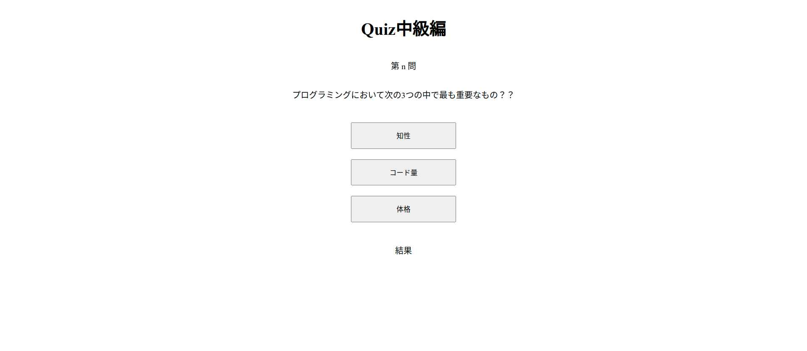

# クイズアプリ中級

## Quiz アプリ中級編の仕様

- ブラウザ上に問題と選択肢を表示．HTML には直接記述しない．
- 選択肢をクリックしたら正解かどうかを判定．
- `alert()`で正解不正解を表示．ブラウザ上にも正解不正解を表示．
- 問題数を 3 問にし，回答したら次の問題を表示．

↓ 画面を開くと問題が表示される．



↓ 適当なボタンをクリックすると正解不正解が表示される．問題文と選択肢が次のものに切り替わる．


## 必要な処理

### 読み込み時の処理

- 結果を記録する配列を準備する．
- 指定した場所に問題文を表示する．
- 各ボタンに選択肢を表示する．
- 各ボタンの`value`に選択肢の値を設定する．

### 選択肢クリック時の処理

- button タグの`value`の値を受け取る．
- 正解の値と等しいかどうか判定する．
- 正解不正解を表示する．
- 正解不正解の結果を配列に追加する．
- 次の問題文と選択肢を表示する．

## 読み込み時の処理

### HTML 要素

画面の HTML 要素は以下のようになっている．

```html
<h1>Quiz中級編</h1>

<p>第 n 問</p>

<p id="question"></p>

<ul>
  <li><button id="answer00">0</button></li>
  <li><button id="answer01">1</button></li>
  <li><button id="answer02">2</button></li>
</ul>

<p>結果</p>
<p id="result"></p>
```

### JavaScript の処理 1（読み込み時）

1. 結果を記録する配列を準備する．
   - 空の配列を用意すれば OK．
2. 指定した場所に問題文を表示する．
   - 処理自体は初級編と同様．
   - 問題が複数あるため，配列形式となっている点に注意．
   - 結果記録用配列の `length` を用いることで何問目なのかを指定することができる．
3. 各ボタンに選択肢を表示する．
   - こちらも初級編と同様．
   - 何問目なのかの指定は問題文と同様．
4. 各ボタンの`value`に選択肢の値を設定する．
   - 初級編と同様．

```js
// quiz01.html

// ↓問題文（設定済み）
const quiz = [
  {
    question: "プログラミングにおいて次の3つの中で最も重要なもの？？",
    answers: ["知性", "コード量", "体格"],
    correct: 1,
  },
  {
    question: "課題をつくるときに大事なことは？？",
    answers: ["斬新なアイデア", "コミットする時間", "洗練されたコード"],
    correct: 1,
  },
  {
    question: "コードを書くことに疲れたときはどうするのがよいか．",
    answers: ["温泉に浸かる", "ビールを飲む", "更にコードを書く"],
    correct: 2,
  },
];

// 1. 結果記録用の配列を用意
const result = [];

// 2. 問題文の表示
$("#question").text(quiz[result.length].question);

// 3. 選択肢の表示
$("#question").text(quiz[result.length].question);
$("#answer00").text(quiz[result.length].answers[0]);
$("#answer01").text(quiz[result.length].answers[1]);
$("#answer02").text(quiz[result.length].answers[2]);

// 4. `value`の設定
$("#answer00").val(0);
$("#answer01").val(1);
$("#answer02").val(2);
```

### JavaScript の処理 2（正解不正解の判定と結果表示）

1. button タグの`value`の値を受け取る．
   - 初級編と同様．
2. 正解の値と等しいかどうか判定する．
   - 初級編と同様．
3. 正解不正解を表示する．
   - 初級編と同様．
4. 正解不正解の結果を配列に追加する．
   - `push()`で配列に値を追加することができる．
5. 次の問題文と選択肢を表示する．
   - 結果記録用配列の `length` を使えッ！

```js
$("button").on("click", function (e) {
  if (Number(e.target.value) === quiz[result.length].correct) {
    $("#result").text("正解！！！");
    // 結果を配列に追加
    result.push("ok");
  } else {
    $("#result").text("不正解．．．");
    // 結果を配列に追加
    result.push("ng");
  }
  // 問題文と選択肢を更新
  $("#question").text(quiz[result.length].question);
  $("#answer00").text(quiz[result.length].answers[0]);
  $("#answer01").text(quiz[result.length].answers[1]);
  $("#answer02").text(quiz[result.length].answers[2]);
});
```

## 練習

クイズ中級編を実装しよう！

できた人は下記にもチャレンジ！

- 画面上の「第 n 問」に何問目かの数値を表示する．
- 3 問目終了時に終了の判定を行う．
- 問題を 6 問まで追加する．
- 終了時に正解数を表示する．
- 終了時に正答率を表示する．
