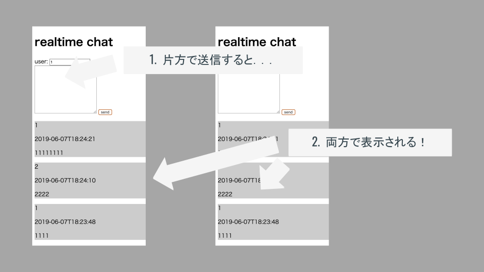

# リアルタイムチャットの実装

## 今回実装するアプリケーション

LocalStorageを利用したメモ帳アプリケーションでは，データを「ブラウザ」自体に保存する処理を実装した．

今回は更に発展させ，オンライン上にデータを保存する処理を実装し，リアルタイムに表示が更新されるチャットアプリケーションを実装する．

このような動きを実装するために，Googleが提供する「Firebase」を活用する．

## Firebase（Cloud Firestore）とは

Firebaseは、クライアントからアクセス可能なデータベースとしてFirebase Realtime Database( 以下 Realtime Database)とCloud Firestoreの2つを用意しています．

Realtime Databaseは，リアルタイムでクライアント全体の状態を同期させる必要があるモバイルアプリ向けの効率的で低レイテンシなものです．

Realtime Databaseはクラウド上でホスティングされるNoSQLのデータベースです．データはすべてのクライアントにわたってリアルタイムに同期され、アプリがオフラインになっても利用可能です．クロスプラットフォームアプリを構築した場合でも，すべてのクライアン トが1つのRealtime Databaseを共有して，最新のデータへの更新を自動的に行います．またクライアントからも直接アクセスが可能なため自前のサーバなしで使えるデータベースとしても活用できます．

Cloud Firestoreは，直感的な新しいデータモデルで，Realtime Databaseの性能をさらに向上しており，Realtime Databaseよりも豊かで高速なクエリとスケールを備えています．Cloud Firestoreは2017年のGoogle I/Oで発表されたプロダクトであり，2018年5月現在はベータ版リリースです．

引用：WEB+DB PRESS vol.105 第4章（※2019年2月より正式版として運用されています．）

## つまり．．？

- サーバ上にデータを保存できる！
- 保存したデータをリアルタイムに同期できる！
- 異なるデバイスでもデータを共有可能！
    - PCとスマホでリアルタイムにデータを同期できる．
- JavaScriptのみで実装可能！
    - Swift, Go, Pythonなど他の言語でも使用可！

||データの保存場所|データを使用できる範囲|
|--|--|--|
|LocalStorage|ブラウザ|自分のPC（ブラウザ）|
|Firebase|オンライン上のサーバ|同じアプリケーションを動かしている端末全て|

Firebaseを活用するにはアカウントやプロジェクトの準備が必要になるため，次項から進める．