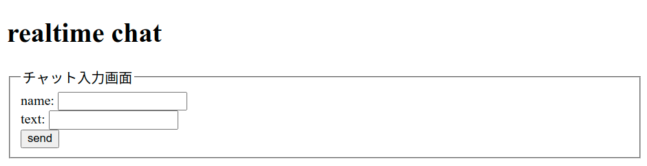
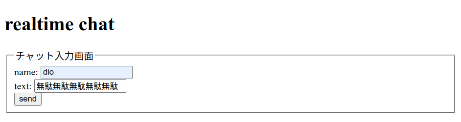
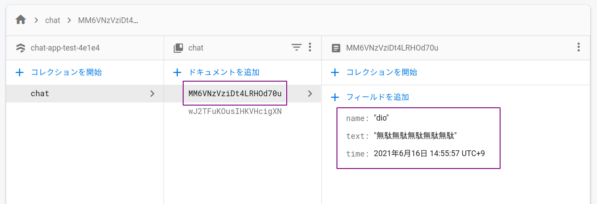

# チャット画面の実装とデータの送信

## チャット画面の実装

name と text の入力欄を作成する．

送信時に id を指定して入力した値を取得するため，`<input>`タグの 2 箇所と`<button>`に id を指定する．

```html
<!-- chatapp.html -->

<form>
  <fieldset>
    <legend>チャット入力画面</legend>
    <div>name: <input type="text" id="name" /></div>
    <div>text: <input type="text" id="text" /></div>
    <div>
      <button type="button" id="send">send</button>
    </div>
  </fieldset>
</form>
```

下図のような画面となる．



## データ送信の処理

続いて，上記の入力画面で name と text を入力して送信ボタンをクリックしたタイミングで Firestore 上に新しいデータを作成する処理を実装する．

### リアルタイム通信の準備

前項で作成したコレクションとやり取りをするため，下記のコードを追記する．

### 💡 Key Point

> このコードでは接続情報を`db`に保存する．この 1 行を書いておくことで`db`に対してデータの追加や取得ができるようになる．

```js
// chatapp.html

import { initializeApp } from "https://www.gstatic.com/firebasejs/9.2.0/firebase-app.js";

// 🔽 追加 / `9.2.0`の部分を↑のFirestoreから貼り付けたコードのバージョンに合わせる
import {
  getFirestore,
  collection,
  addDoc,
  serverTimestamp,
} from "https://www.gstatic.com/firebasejs/9.2.0/firebase-firestore.js";

const firebaseConfig = {
  // 省略
};

const app = initializeApp(firebaseConfig);

// 🔽 追加
const db = getFirestore(app);
```

### 送信ボタンクリック時にデータを送信

続いて，送信ボタンクリック時にデータを送信する処理を実装する．

まずはボタンのクリックイベントを作成．

```js
// chatapp.html

$("#send").on("click", function () {
  // 送信時に必要な処理
});
```

続いてクリックイベント内に「入力値を取得する処理」と「データを送信する処理」を記述する．

ポイントは，

- id 指定して`.val()`で入力値を取得する．
- データを送信する際にはオブジェクト形式にする必要がある．
- `time`は Firestore の独自形式となるため，Firestore 側で用意されている関数を使用する．

```js
// chatapp.html

const data = {
  name: $("#name").val(),
  text: $("#text").val(),
  time: serverTimestamp(),
};
addDoc(collection(db, "chat"), data);
$("#text").val("");
```

## 動作確認

コードを記述したらブラウザの画面から`name`と`text`を入力して．．．



Firebase のコンソール画面でデータが保存されていれば OK！



## 練習

下記の処理を実装し，Firestore にデータを保存しよう！

1. 入力画面の作成
2. データの送信処理
