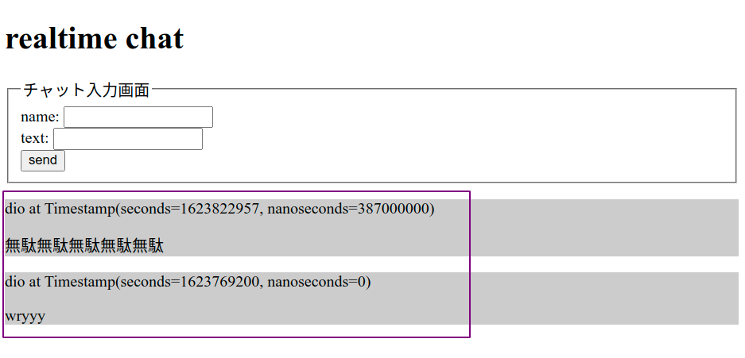

# データのリアルタイム取得と画面表示

## 保存されているデータの扱い

Firestoreではデータの取得方法はいくつか用意されているが，最大の特徴は「データベースの変更を検知して自動的にデータを取得できる」ことである．

（本来はサーバ側の言語での実装が必要であり，難易度も高い．WebSocketなどの実装が必要）

## 処理の流れ

流れは送信と比較して複雑となる．理由は以下のとおり．

- 動作のタイミングがつかみにくい．
- 取得したデータが非常に複雑な状態．
- 必要な3項目を取得するためにFirestore側で用意された関数を使用する必要がある．

## データの取得

まずはFirestore上に保存されているデータを取得してconsoleに出力する．

- データに変更（追加，更新，削除など）が生じたタイミングで実行される`.onSnapshot()`を使用する．
- `.onSnapshot()`はデータベース上でデータの変更が発生したタイミングで`{}`内の処理を実行する．
- Firestore上に保存されているデータは`querySnapshot.docs`に入っている．

```js
// chatapp.html

db.onSnapshot(function (querySnapshot) {
  console.log(querySnapshot.docs);
});

```

## データの取り出し

上記`querySnapshot.docs`は非常に複雑な形となっており，このまま扱うことは難しい．

そのため，必要なデータのみ抽出した「オブジェクト形式の配列」に変換する．

1. 空の配列を準備．
2. `querySnapshot.docs`に対して繰り返し処理を用いて各要素に対して，
    - `.id`でドキュメントID（名前）を取得する．
    - `.data()`でドキュメント中身（3項目）を取得する．
3. 上記のデータのみを1で用意した配列に追加．

```js
// chatapp.html
// 前項の`console.log()`下に記述

const dataArray = [];
querySnapshot.docs.forEach(function (doc) {
  const data = {
    id: doc.id,
    data: doc.data(),
  };
  dataArray.push(data);
});

console.log(dataArray);

```

### 💡 Key Point

>難しい形式のデータは変換して「自分が慣れている形式」に変換すると扱いやすい．


## 画面表示するためのタグ生成

必要な情報のみを抽出した配列が作成できたため，この配列から画面表示用のタグを作成する．

前項で作成した`dataArray`を基にして，

1. 空の配列を準備する．
2. `dataArray`に繰り返しを用い，各要素をタグの形にする．
3. 繰り返し処理終了後に指定したid部分に出力する．

```js
// chatapp.html
// 前項の`console.log()`下に記述

const tagArray = [];
dataArray.forEach(function (data) {
  tagArray.push(`
    <div id="${data.id}">
      <p>${data.data.name} at ${data.data.time}</p>
      <p>${data.data.text}</p>
    </div>
  `);
});

$('#output').html(tagArray);

```

## 動作確認

上記のコードを記述すると「Firestore上でデータが変更されたタイミング」で`{}`内の処理が実行され，最新のデータが画面に反映される．



また，「Firestore上でデータが変更されたタイミング」で動作するため，複数タブで片方だけ操作した状態でもう片方の動作を確認することができる．

