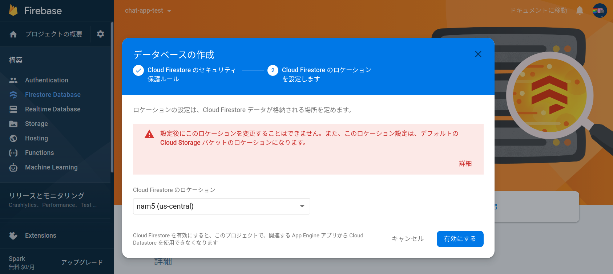
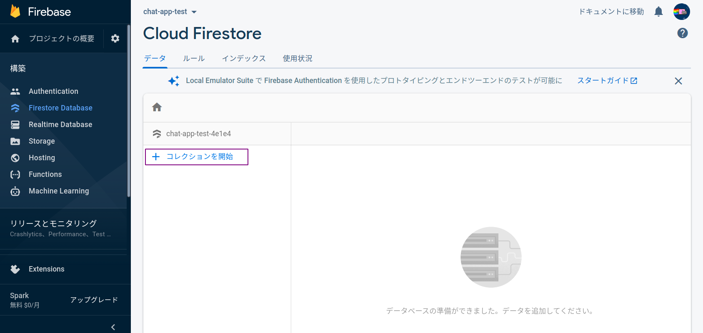
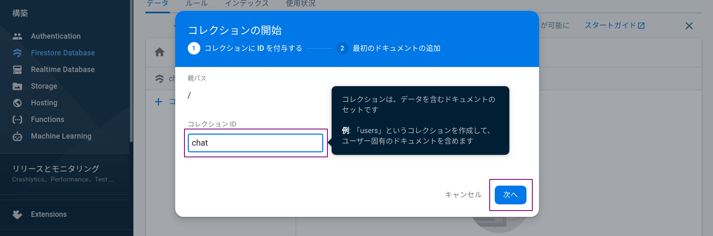

# Firebaseの準備3（データベースの準備）

## データベースの準備

データを実際に保存するためのデータベースを準備する．

コンソール画面から「構築」 -> 「Firestore Database」 -> 「データベースを作成」の順にクリック．

ルールは必ず「テストモードで開始」を選択して「次へ」をクリック．

ロケーションは適当でOK．「有効にする」をクリックすると次の画面に移動する．

## コレクションの作成

データを保存する際には「コレクション」と「ドキュメント」という単位で管理する．

これらは「フォルダ」と「ファイル」の関係によく似ている．

[参考（ドキュメント）](https://firebase.google.com/docs/firestore/data-model?hl=ja)

||データの容器|データの単位|
|--|--|--|
|PC|フォルダ|ファイル|
|Firestore|コレクション|ドキュメント|

Firestoreの機能を利用するには「コレクション」を作成してテストデータを入力しておく．下記画面の「コレクションを開始」をクリックする．

コレクションIDに「`chat`」を入力し「次へ」をクリックする．

テスト用のドキュメントを作成する．

- ドキュメントIDは「自動ID」をクリック．
- フィールドには「`name`」「`text`」「`time`」の3項目を設定．
- `name`と`text`には`String`，`time`には`timestamp`形式を選択する．
- 各フィールドには適当な値を入力しておく．

設定したら「保存」をクリックする．

下記のようにデータが保存されていればOK！

