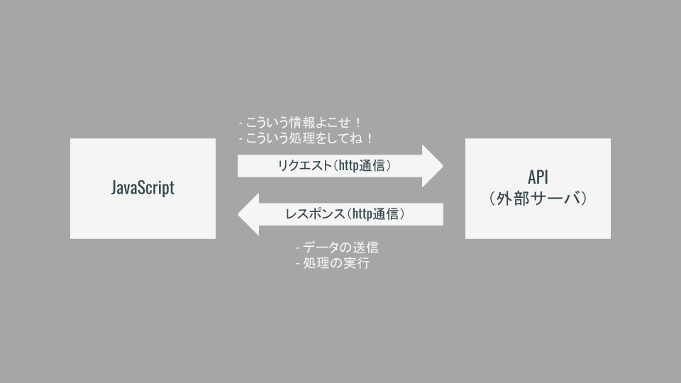

# APIとは

## APIの意味合い

Application Programming Interfaceの略．

あるアプリケーション（例えばGoogle MapやTwitterなど）の一部を外部に向けて公開することにより，第三者が開発したソフトウェアに機能を組み込めるようにしたものである．

世の中に存在するサービスの機能の一部を使わせてもらえるイメージ！

>Interface
>- Interfaceは「あるもの」と「あるもの」をつなぐもの，という意味合い．
>- 今回は（すでに動いている）アプリケーションと（開発者が実装する）プログラムをつなぐ．

## APIの一例

|API名|概要|
|-|-|
|Bing Maps API|リクエストに応じてブラウザに地図を表示したり，ルート検索したりする．|
|Google Books API|Google Booksが持っている書籍の情報から，キーワードなど指定してデータ- を返す．|
|Open Weather Map API|都市名や緯度経度を指定して，その日の天気や天気予報の情報を返す．

## APIの利点

- 他社のデータを利用できる！
- 自分で作らなくて良いので開発速度がアップ！
- いろいろなAPIを組み合わせてアプリケーションを実装できる！

## 動き方のイメージ

基本は「リクエスト」と「レスポンス」！

API（外部のサーバ）にJavaScriptでリクエスト（要求）を送信し，API側にデータを返してもらったり処理を実行してもらったりする．

Webアプリケーションのサーバ側の処理をAPIに行ってもらうイメージ！

### APIにリクエストを送信してデータをもらうタイプ（こちらが一般的）

検索条件などを指定して，条件に合う情報を送ってもらう．

|API|送信するデータ|受け取れるデータ|
|-|-|-|
|Google Books API|本のタイトルに含まれるキーワード，著者，出版社，出版年，etc...|条件に該当する本のデータ|
|Open Weather Map API|都市名，緯度経度，etc|現在の気象情報，一週間分の天気予報，etc...|
|テキスト解析|テキストデータ|テキストの感情データ，要，約，etc...|
|画像認識|画像データ|画像に映っているもの名称，位置，etc...|
|音声認識|音声データ|音声を文字起こししたテキスト|

### APIに定められたコードを実行してブラウザを操作してもらうタイプ

条件を指定して，実際にブラウザ表示などをやってもらう．

|API|やってもらえること|
|-|-|
|Bing Maps API|場所などを指定して地図を表示，ルート検索，住所を緯度経度に変換，etc...|
|Google Maps API|地図表示，ストリートビュー表示，etc...|

