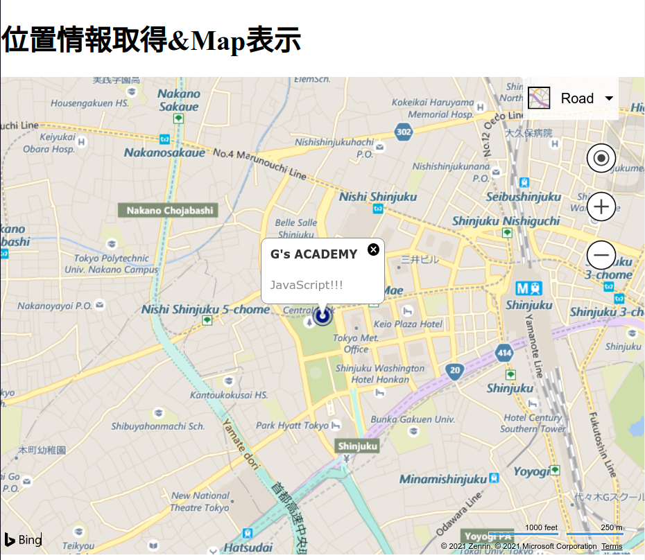

# BingMapsAPI/機能追加

ピンの生成
ピンを立てる関数を定義する．
ピンの色などを指定する．
マップ上に設置
マップ表示後にピンを立てる関数を実行する．

```js
// 緯度，経度，表示したいマップを入力するとピンを立てる関数を定義．
// ピンの色と表示するよう設定．

function pushPin(lat, lng, map) {
  const location = new Microsoft.Maps.Location(lat, lng)
  const pin = new Microsoft.Maps.Pushpin(location, {
    color: 'navy',		// 色の設定
    visible: true,		// これ書かないとピンが見えない
  });
  map.entities.push(pin);
};
```

```js
// マップを表示する「mapsInit()」関数内でピンを設置する関数を実行．

function mapsInit(position) {
  const lat = position.coords.latitude;
  const lng = position.coords.longitude;
  // マップ表示の処理（省略）
  pushPin(lat, lng, map);
}


```

infoboxの生成
infoboxを生成する関数を定義する．
表示内容を指定する．
マップ上に設置
マップ表示後にinfoboxを生成する関数を実行する．

```js
// 緯度，経度，表示したいマップを入力するとinfoboxをつくる関数を定義．
// 表示内容を設定する．

function generateInfobox(lat, lng, map) {
  const location = new Microsoft.Maps.Location(lat, lng)
  const infobox = new Microsoft.Maps.Infobox(location, {
    title: `G's ACADEMY`,
    description: "JavaScript!!!"
  });
  infobox.setMap(map);
}
```

```js
// マップを表示する「mapsInit()」関数内でinfoboxを生成する関数を実行．

function mapsInit(position) {
  const lat = position.coords.latitude;
  const lng = position.coords.longitude;
  // マップを表示する処理（省略）
  pushPin(lat, lng, map);			// ピンを立てる関数
  generateInfobox(lat, lng, map);	// infoboxを生成する関数
}
```




他にも機能たくさん！！
ドキュメントも読んでみよう！
https://bingmapsv8samples.azurewebsites.net
山崎先生が作ったサンプル集！！
（かなり参考になる！！）
https://mapapi.org
