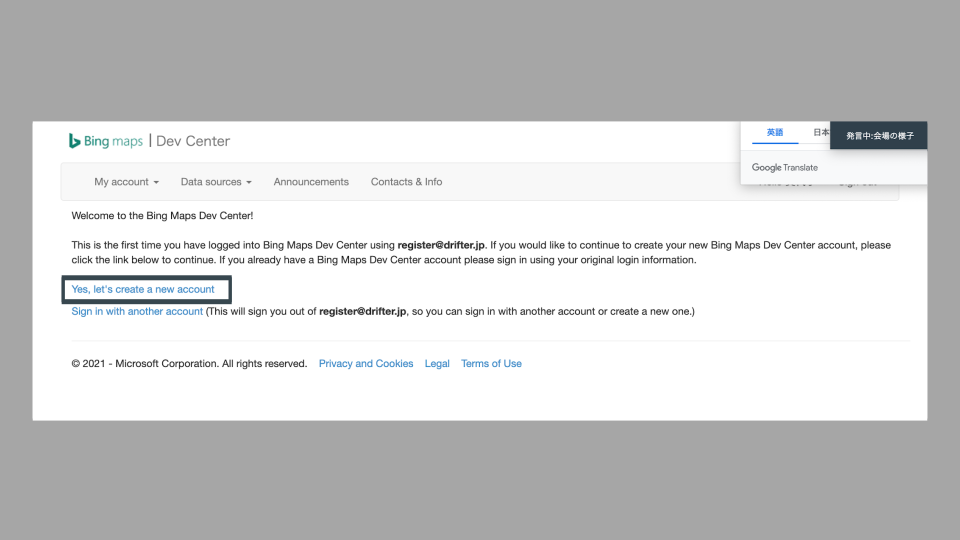

# BingMapsAPI/準備

## Bing Maps APIとは

Microsoftが提供する地図APIである．位置情報との連携を中心に様々な機能を提供する．

今回は前項で取得した位置情報を利用し，現在地付近の地図をブラウザ上に表示するアプリケーションを実装する．

### 特徴

- JavaScriptのみで実装可能．
- 機能を実現するために必要なコードはMicrosoftが定めている．決められたコードを記述するだけで様々な機能を実装可能．
- 支払い情報など登録する必要なく無料で使用可能．

### 機能例

- 任意の地点・縮尺で地図の表示．
- 出発地，到着地を指定したルート検索．
- 地図上の任意の地点にピン，Infobox（吹き出し），などを設置．
- 住所から緯度経度を取得．
- 緯度経度から住所を取得．

## 準備

Bing Maps APIを使用するためにはいくつかの準備が必要となる．主な手順は以下のとおり．

1. Microsoftアカウントが必要（事前準備済）．
2. Bing Maps API開発者アカウントの準備．
3. API keyの発行．
4. （実際にコードを記述する）

### 開発者アカウントの準備

まずは下記のURLにアクセス！

[https://www.bingmapsportal.com](https://www.bingmapsportal.com)

下記の画面から「Sign In」ボタンをクリック．

Microsoftアカウントでログインする．

画面が切り替わるので「Yes, let's create a new account」をクリックし，アカウント情報を入力する．

メールアドレスはMicrosoftアカウントと同じものを使用すると管理しやすいだろう．

### API keyの発行

アカウントが作成できたら，画面上部のタブの「My account」 -> 「My Keys」をクリックする．

アプリケーション名を入力し，API keyを作成する．アプリケーション名以外は初期状態のままで構わない．

アプリケーション名は「何のアプリケーションなのか」がわかる名前にしよう．

作成が正常に完了すると自動的に画面が切り替わる．下図の「Show key」部分をクリックするとAPI keyが表示される．

API keyは後ほどコード内に記述する必要があるため，この画面は開いたままにしておくとスムーズである．

