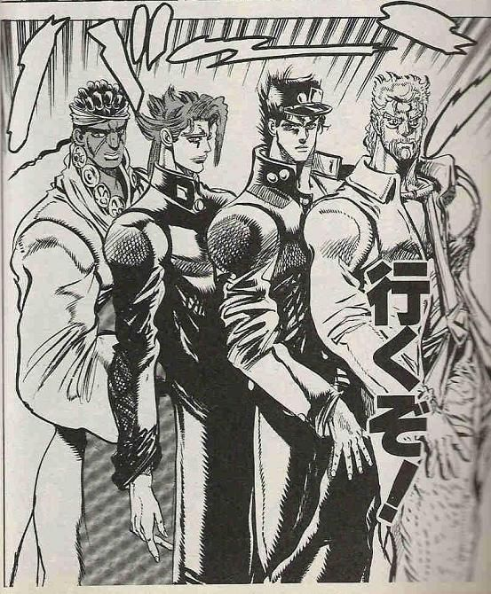

# JS選手権

## JS選手権とは

- JavaScriptの集大成！！
- JavaScriptのみを使ってセカイを変えるアプリケーションを作ろう！！
- チーム開発！！！

## なにつくるんじゃ？？

基本的に何を作ってもOK！
  - オンラインリアルタイムじゃんけん
  - 無限マインスイーパ
  - グラディウス
  - DVDをおすすめするチャットボット

（JavaScript以外を使ってもOK．．．ただし評価基準は同じッ）

## 発表

### 発表会概要

MM/ddの10:30から各チーム5分で発表！（+適宜質疑など）

- 企画の概要&価値，プロダクトの紹介，実装の工夫，など．
- GGAのプレゼンを意識．．！！！（<- プレゼンの練習も大事！）
- 発表順はランダム（当日決めます）
- GGA形式で投票🗳️

### 発表に含める内容

- このアプリケーションはなにか？何を達成するのか？
- アプリケーションのデモ．
- 上記を達成するために工夫した点，苦戦した点．
- チーム内の役割分担．
## 進め方ののtips

### 仕様書を作ろう！

- 誰のためのどんなアプリケーション？？どんな画面が必要？？
- アプリケーションが実現することを明確にしよう！
- （できるだけ細分化して）必要な機能をリストアップ！
- 試行錯誤しながらそれぞれを単体で実装→組み合わせ！
- つくりながら仕様書はアップデート！

### スケジュールをつくろう！

- 目標を複数設定！
- （最低限の機能，予想以上に進んだら．．．，など）
- スケジュールは都度更新！  毎日進捗に応じて見直す！

### その他

- プロダクトに名前をつけよう！
- （できる人はデプロイすると更に良いです）

## 評価規準

企画点と技術点を下記の基準で評価！

「企画点」「技術点」をそれぞれ算出し，平均して「総合点」とします！

表の対応に従って計算し，点数が最も少ないチームが優勝！！

|評価|点数|
|-|-|
|S|1|
|A|2|
|B|3|
|C|4|
|D|5|
### 企画点（アイデア基準）

- 使ってみたい，おもしろいと感じるプロダクトか．
- 実現したいことが明確か．課題を解決できそうか．
- プレゼンのロジックが明確になっているかどうか．

### 技術点（コード基準）

- コードの量
- 実装の工夫（技術選定や工夫，読みやすさ，複数人でのコード管理など）
- プロダクトの完成度（アイデアを実現するために細かい部分まで作り込んでいるか，など）

## それでは．．．！

