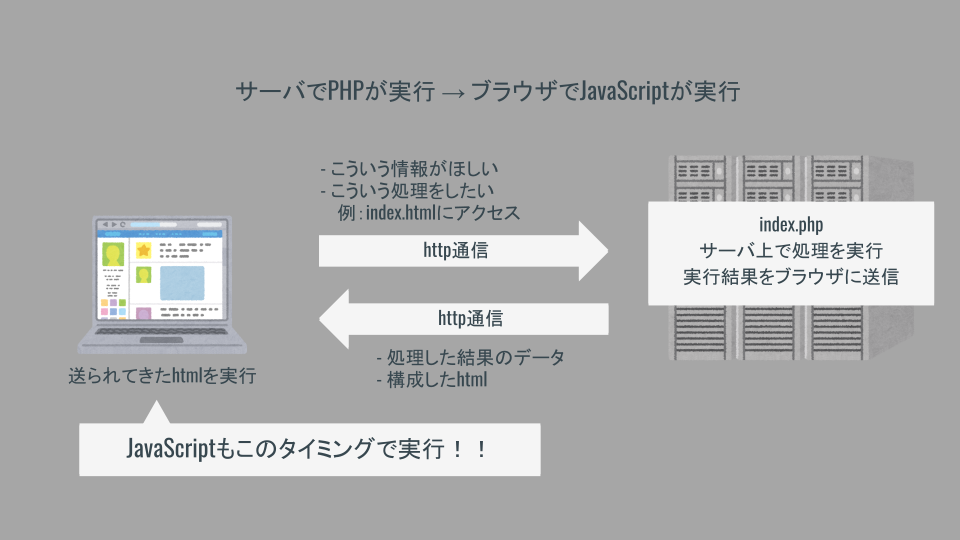

# 課題

**csvファイルを用いたアンケートシステムをつくろう！**

## 構成（例）

- 入力画面（index.php）
- 書き込みファイル（create.php）
- 読み込みファイル（read.php）

最低限ここまで！

## アンケート内容（例）

- 名前，email，任意の質問を入力
- 入力内容をcsv形式で「data/data.csv」に保存
- 読み込みファイルでcsvファイルの内容を表示

※例によってアンケート項目とか適当でOK！

## アップグレード

- 同じ画面で送信と表示を実行
- csvファイルの内容の集計結果をグラフ表示，デザインをかっこよく
- 結果に応じた評価機能とか統計解析とか
- 卒制のアイデアでつくってみる！！

## PHPとJSを組み合わせろ！！

- PHPはJavaScriptと比較して自由度が低い．．！
- PHPは狙ったデータを確実に取得できるように！！
- 凝った画面表示や動きはJSを使おう！！



PHPのデータをJSに渡す例

```php
<?php
// これはPHPの配列
$hoge_array = ['PHP', 'JS', 'Rust', 'COBOL'];
?>

<!DOCTYPE html>
  <head>
    // 省略
  </head>
  <body>

    <p>ここでJSONが活躍するのじゃ．．！</p>

    <script>
      // JSではPHPの配列を扱えないため，サーバ上でJSON形式に変換する
      const hogeArray = <?=json_encode($hoge_array)?>;
      console.log(hogeArray);

      // あとはわかるな．．？？
    </script>

</body>
</html>

```