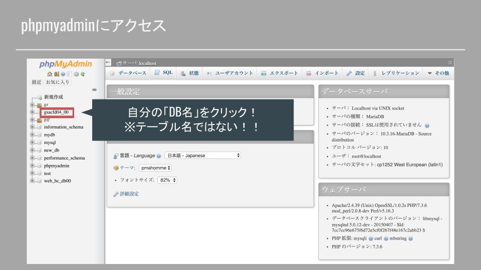
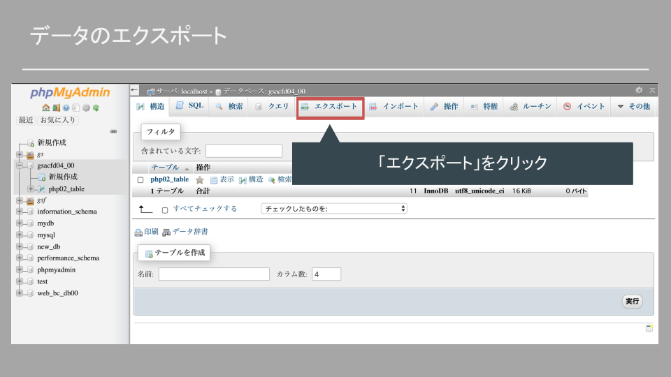
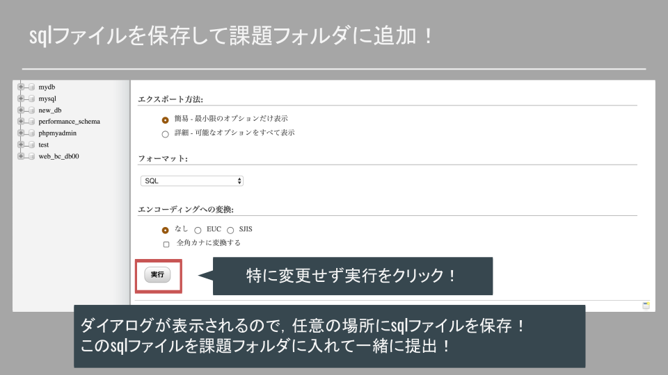

# 課題と提出時の注意点

**DBを使用したアプリを実装しよう！**

DBを扱うことでWebアプリケーションの基本的な機能を実装できる．日頃使っているWebアプリケーションの中で，DBやSQLがどのように使われているのかイメージしてみると，活用方法のイメージが湧くだろう．

## DBやテーブル

- DB名：今回作成したものを使用
- テーブル構成：自由に！（講義で使用した`todo_table`の構成は変更しないこと！）

## 構成

基本は下記ファイル（処理）を作成！（ファイル構成や名前は変更してOK！）

- input.php	（作成画面）
- create.php	（作成処理）
- select.php	（参照&表示処理）

卒制のプロトタイプ的な作品とか，SNS的なものとか！

## ⚠️ 注意点

- DB使用時にはDBに保存されたデータも必要．
- DBのデータ（テーブルなど）もまとめて提出！
- 「DB」は必ず授業でつくったものを使用すること！

