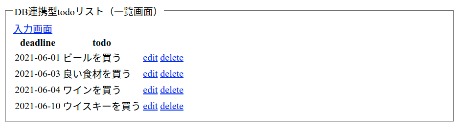
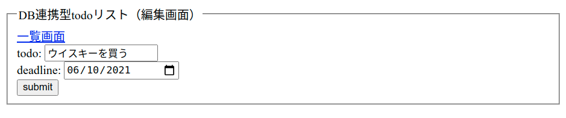

# PHPとDBの連携3（編集画面の作成）


## 処理の流れ

データ更新の処理はデータ作成処理の流れと似ている！

まずは本項で1と2を実装する．

1. 一覧画面に更新ページへのリンクを作成（urlにidを追加： todo_edit.php?id=**）
2. 更新ページの作成（todo_edit.php）
3. 更新処理の作成（todo_update.php）
4. 一覧画面に戻る

## 一覧画面にリンク追加

`<a>`を用いて編集画面（と削除処理）へのリンクを作成する．

GETメソッドが「データをURLに格納する」仕様を利用し，`<a>`のURLに各データの`id`を埋め込む．

```php
// todo_read.php

foreach ($result as $record) {
  $output .= "
    <tr>
      <td>{$record["deadline"]}</td>
      <td>{$record["todo"]}</td>
      <td>
        <a href='todo_edit.php?id={$record["id"]}'>edit</a>
      </td>
      <td>
        <a href='todo_delete.php?id={$record["id"]}'>delete</a>
      </td>
    </tr>
  ";
}

```

下図のようにリンクが表示されればOK．

リンクにマウスカーソルを当てると，ブラウザ左下にリンク先のURLが表示される．`id=**`の形で数値が表示されれば正しく指定されている．



## 編集画面の作成

続いて，編集画面を実装する．

本画面の役割は

- 現在テーブルに保存されている`todo`と`deadline`を表示する．
- ユーザが画面上でデータを編集する．
- ユーザが編集したデータをテーブル更新用ファイル（`todo_update.php`）に送信する．

コードのポイントは以下．

- SELECT文を用いて`id`指定し，`fetch()`関数でデータを取得する．
- 取得したデータを`<input>`の初期値として設定する．
- 次の更新処理で`id`が必要になるため，`<input type="hidden">`を用いて`id`を送信する．

```php
include("functions.php");

$id = $_GET['id'];

$pdo = connect_to_db();

$sql = 'SELECT * FROM todo_table WHERE id=:id';
$stmt = $pdo->prepare($sql);
$stmt->bindValue(':id', $id, PDO::PARAM_INT);
$status = $stmt->execute();

if ($status == false) {
  $error = $stmt->errorInfo();
  echo json_encode(["error_msg" => "{$error[2]}"]);
  exit();
} else {
  $record = $stmt->fetch(PDO::FETCH_ASSOC);
}
?>

// 以下HTML部分
<form action="todo_update.php" method="POST">
  <fieldset>
    <legend>DB連携型todoリスト（編集画面）</legend>
    <a href="todo_read.php">一覧画面</a>
    <div>
      todo: <input type="text" name="todo" value="<?= $record['todo'] ?>">
    </div>
    <div>
      deadline: <input type="date" name="deadline" value="<?= $record['deadline'] ?>">
    </div>
    <div>
      <input type="hidden" name="id" value="<?= $record['id'] ?>">
    </div>
    <div>
      <button>submit</button>
    </div>
  </fieldset>
</form>

```

下図のように現在のデータが画面に表示されればOK．




## 練習

以下の処理を実装しよう！

1. 一覧画面に`todo_edit.php`へのリンクを追加！（`todo_delete.php`へのリンクも一緒に！）
2. `todo_edit.php`ではデータをIDで検索し，該当するデータを画面に表示！
