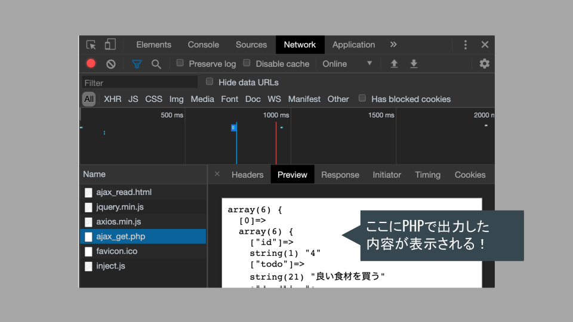

# Ajax実装

## Ajax（Asynchronous JavaScript And XML）とは

DBへの登録，表示などの処理を実行するPHPファイルとのhttp通信を「JavaScriptで」扱う手法ッ！！

JavaScriptでhttp通信を行うコードを記述し，サーバからデータを取得して動的にページの一部を書き換える動作が中心となる．

もともとは`XML`形式のデータをやり取りしていたが，現在は`JSON`形式が主流である．

### 動き方のイメージ

これまでに扱ったFirebaseやAPI連携と似た動き．この場合はGoogleなどがつくってくれたサーバと通信を行ってデータを取得していた．


今回は自分でサーバ側のPHPを実装する．自分でAPIをつくっている状態！


### メリット

- データだけをやり取りするので速い&通信量が少ない（HTML全部は重い）！
- ファイル数が少なくできる & フロントとサーバの分業がしやすい！
- 通信時にリロードがない！ <- Googleマップや無限スクロールなどで活用されている！

### デメリット

- SEOに弱い（最近は大丈夫になってきている）．
- 動的にページの内容を更新するので構造が複雑になりがち．
- ページを更新すると表示内容が初期状態に戻ってしまう．


## JavaScriptでhttp通信を行う方法

主に下記4種類が存在する．下に行くほど新しい&オススメ．

今回は`axios`ライブラリを使用する．

|方法|特徴|
|-|-|
|XMLHttpRequest|生JS / 一番昔から存在する|
|$.ajax()|jQuery / これが出てきて流行った|
|fetch|生JS / 慣れないと分かりづらい|
|axios|ReactとかVueでも使われていて使い勝手が良い|


## 今回実装する内容

Ajaxを使ってリアルタイム検索を実装しよう！！

- 検索ボックスになにか入力したら，該当するデータだけをDBから取り出して画面に表示する．
- 「検索ボタン」ではなく，入力した時点でリアルタイムに検索する．

### 💡 Key Point

>※JavaScriptとPHPが入り乱れるので都度どちらを書いているか確認！！！


## 必要なもの

### JavaSciptのコード（`ajax_search.html`）

- 検索ボックスからリアルタイムに入力値を取得する．
- PHPファイルに対してリクエストを送る処理．
- APIへのリクエストと同じく`axios.get()`を使用．

### PHPのコード（`ajax_get.php`）

- DBからデータを取得する処理．
    - 前回までのtodo_read.phpとほぼ同様．
- 取得したデータをJSON形式で返す．
- 「API」をPHPでつくる！！！

## 処理の流れ

1. JavaScriptからPHPファイルにリクエスト（検索ワード）を送る．（JS）
2. DBからデータを取得する．（PHP）
3. 取得したデータをJSON形式にして出力する．（PHP）
4. JavaScriptでデータを受け取る．（JS）<- 今回はまずここまでつくろう！
5. （受け取ったデータをブラウザに表示）

## JavaScript側のコード

まず，検索ボックス（`#search`）に対して`keyup`イベントを作成し，キーボード操作時に入力された値を取得できるようにする．

また，送信先のファイル（`ajax_get.php`）も準備しておく．

```js
// ajax_search.html

$('#search').on('keyup', function (e) {
  console.log(e.target.value);
  const searchWord = e.target.value;
  const requestUrl = 'ajax_get.php';
  // ここからhttp通信を行うコード
});

```

続いて，API回と同じく`axios.get()`でデータを取得する．取得したデータはURL末尾にセットされ，サーバから得られたデータは`response`に格納される．

```js
// ajax_search.html

axios.get(`${requestUrl}?searchword=${searchWord}`)
  .then(function (response) {
    console.log(response);
  })
  .catch(function (error) {
    // 省略
  })
  .finally(function () {
    // 省略
  });

```


## PHP側のコード

JavaScriptでは`GET`メソッドでデータを送信しているため，PHPでは`$_GET`でデータを受け取ることができる．

- SQL文作成 & 実行．
- LIKEを使用してキーワードで検索する．
- ユーザが入力した値を使用するのでバインド変数が必須．検索ワードをバインド変数にセットする際に`%`を前後につけることで曖昧検索ができるようにする．

また，今回はJavaScript側にJSON形式のデータを送るので，`json_encode()`を用いている．出力するには単に`echo`するだけでOK！

```php
// ajax_get.php

// 省略（ファイル読み込み，DB接続処理など）

$search_word = $_GET["searchword"];

$sql = "SELECT * FROM todo_table  WHERE todo LIKE :search_word";
// 省略
$stmt->bindValue(':search_word', "%{$search_word}%", PDO::PARAM_STR);
// 省略
if ($status == false) {
  // 省略（エラー処理）
} else {
  $result = $stmt->fetchAll(PDO::FETCH_ASSOC);
  echo json_encode($result);
  exit();
}

```

### 動作確認

一連の動作が正常に動いていれば，テーブルに保存されているデータが検証画面に表示されるはずだ．

一方でサーバ側の動作を（`var_dump()`などで）確認したい場合は検証ツールを用いる．

- 検証ツールの「NetWork」タブでは通信を行っているファイルを確認することができる．
- この中の`ajax_get.php`をクリックすることで，PHPが動作した画面を確認することができる．




## 練習

リアルタイム検索を実装しよう！

- axios.get()でリクエストを送ろう！（`ajax_read.html`）
- DBからデータを取得しよう！（`ajax_get.php`）
- JSON形式にして出力しよう！（`ajax_get.php`）
- 受け取ってconsoleでデータを確認しよう！（`ajax_read.html`）

できた人はブラウザ画面にデータを表示しよう！

