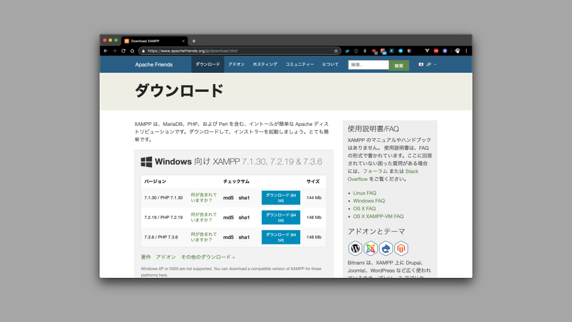
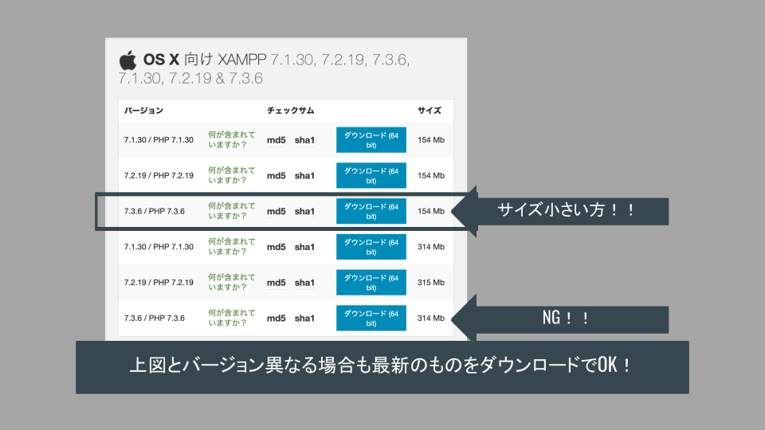
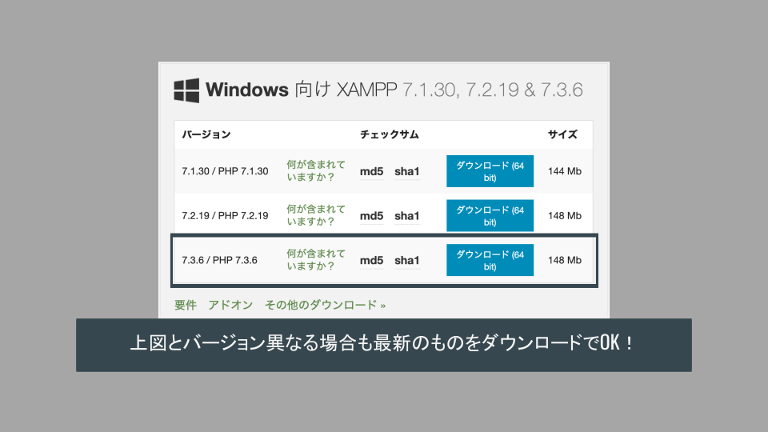
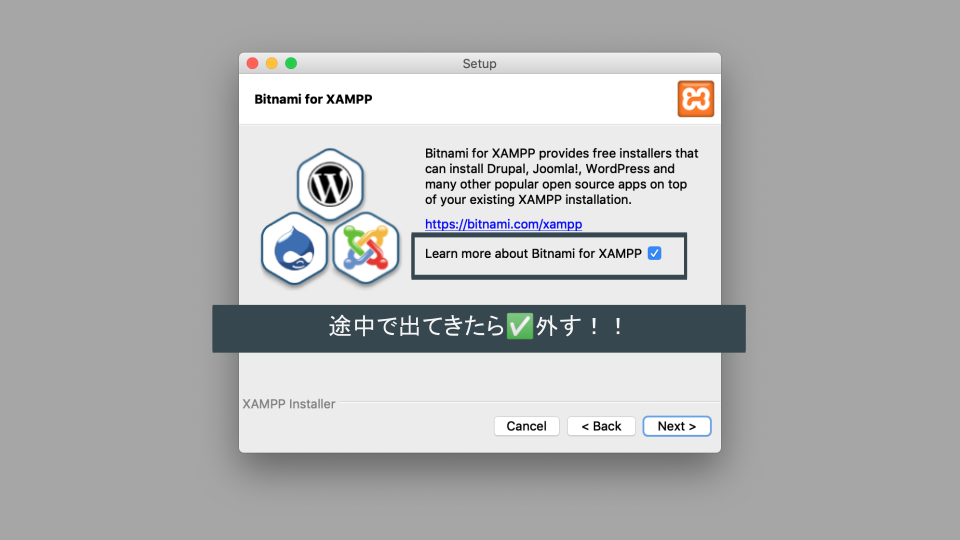
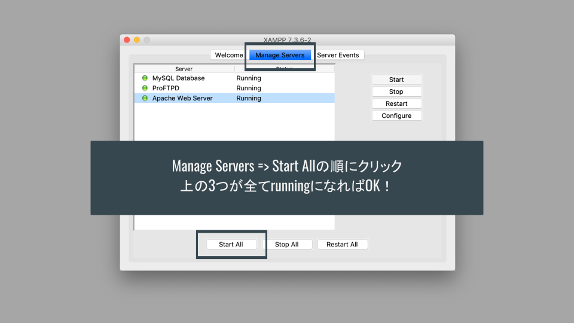
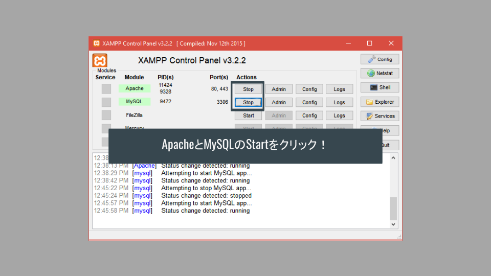
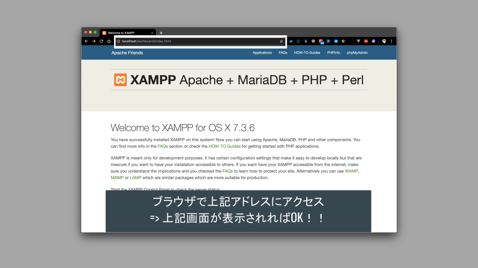

# PHP 事前準備

## サーバとクライアント

サーバで動作する言語（サーバサイド）

- web サーバ上でプログラムが実行される．
- PHP, Ruby, Python, JAVA, (node.js), etc…

クライアント（web ブラウザ）で動作する言語（クライアントサイド）

- web ブラウザでプログラムが実行される．
- html, css, JavaScript

=>サーバサイド言語の開発にはサーバ上で動作させるアプリケーション（xampp など）が必要！

（自分の PC 上でサーバを動かすイメージ）

## サーバのしくみと XAMPP の役割

### サーバの役割及び構成

Web アプリケーションはクライアントとサーバの組み合わせで構成されている．

サーバには「アプリケーションサーバ」と「DB サーバ」が存在し，相互に連携することでアプリケーションを構築している．

（詳しい仕組みの理解は後からで OK．）

### サーバサイド言語での開発と XAMPP の役割

上記のとおり，PHP（及び他のサーバサイド言語）を動作させるには「サーバ」が必要となる．

しかし，自身の PC で開発を行う場合に都度サーバを用意することは効率的ではない．

このような場合に自身の PC 内で擬似的なサーバを用意して PHP を動作させることができるのが「xampp」である．

xampp は以下の役割を提供する．

- PHP を動作させるアプリケーションサーバ（`Apatch web server`）を用意する．
- データを保存するためのデータベース（`MySQL Database`）を用意する．
- その他いろいろ（今回の開発では使用しない）．

## XAMPP 環境構築

### ダウンロード

下記 URL にアクセスする．

[https://www.apachefriends.org/jp/download.html](https://www.apachefriends.org/jp/download.html)

> **！！注意！！**
>
> 資料作成時時点では`7.3.6 / PHP 7.3.6`となっているが，現時点（2021/09/12）では`8.0.9 / PHP 8.0.9`が最新なのでこちらを用いること！！
>
> 上記バージョンより新しいものが表示される場合は最新版をインストールしてください！

↓ アクセス画面

Mac の人は下記からダウンロード．

Windows の人は下記からダウンロード．

### インストール

ダウンロードしたらインストールを進める．

### 動作確認（サーバ起動）

インストールが済んだらアプリケーションを立ち上げる．

Mac の人は以下のようにサーバを起動させる．

Windows の人は以下の画面．

### 動作確認（画面表示）

#### アプリケーションサーバ動作確認

ブラウザで[https://localhost/](https://localhost/)にアクセスして下記画面が表示されれば OK．

#### DB サーバ動作確認

ブラウザで[https://localhost/phpmyadmin](https://localhost/phpmyadmin)にアクセスして下記画面が表示されれば OK．

## まとめ

下記 3 点が実施できていることを確認しよう！

- XAMPP の起動確認
- [http://localhost/](http://localhost/)のアクセス確認
- [http://localhost/phpmyadmin](http://localhost/phpmyadmin)のアクセス確認
